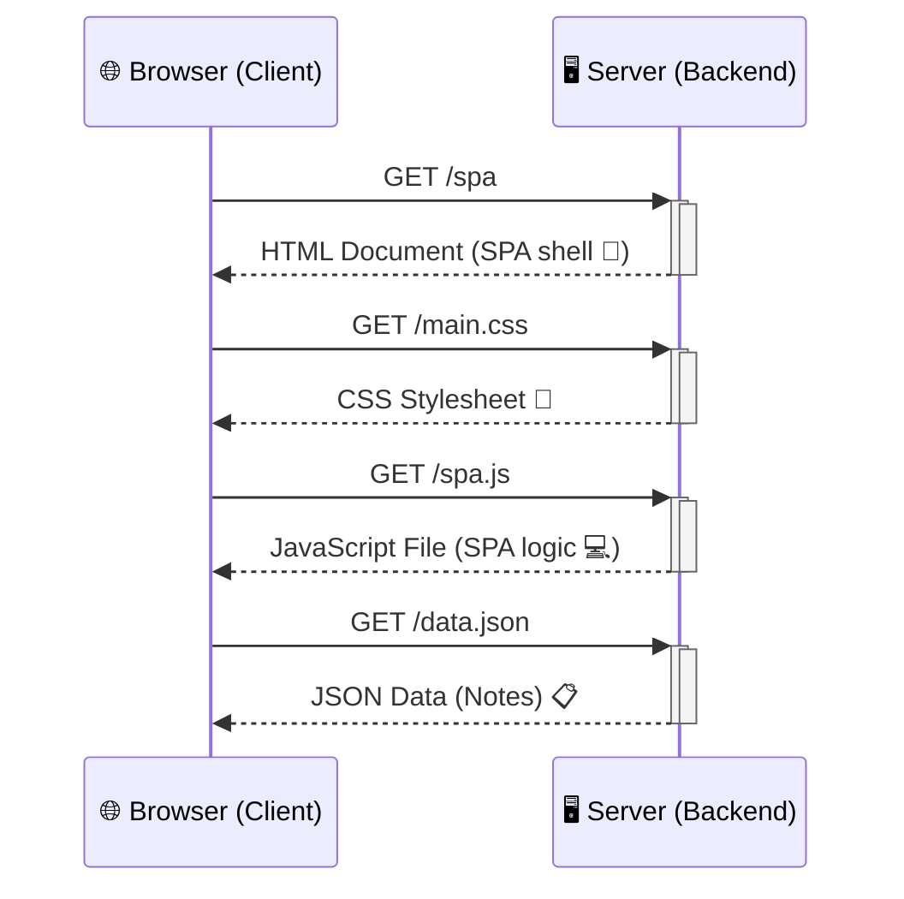

## 0.5: Single page app

### Diagram for [this page](https://studies.cs.helsinki.fi/exampleapp/spa)

```mermaid
sequenceDiagram
    participant browser as 🌐 Browser (Client)
    participant server as 🖥️ Server (Backend)

    %% Step 1: User accesses the SPA
    browser->>+server: GET /spa
    activate server
    server-->>-browser: HTML Document (SPA shell 📑)
    deactivate server

    %% Step 2: Browser fetches styles
    browser->>+server: GET /main.css
    activate server
    server-->>-browser: CSS Stylesheet 🎨
    deactivate server

    %% Step 3: Browser fetches JavaScript for SPA
    browser->>+server: GET /spa.js
    activate server
    server-->>-browser: JavaScript File (SPA logic 💻)
    deactivate server

    %% Step 4: Browser fetches initial note data
    browser->>+server: GET /data.json
    activate server
    server-->>-browser: JSON Data (Notes) 📋
    deactivate server
```
