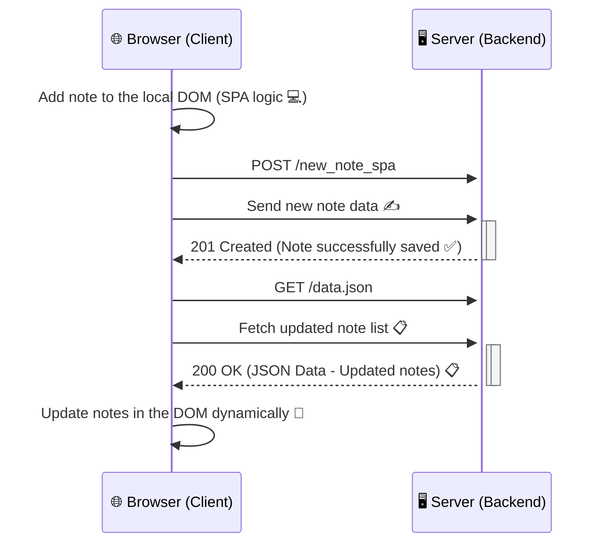

## 0.6: New note in Single page app

### Diagram for [this page](https://studies.cs.helsinki.fi/exampleapp/spa)

```mermaid
sequenceDiagram
    participant browser as 🌐 Browser (Client)
    participant server as 🖥️ Server (Backend)

    %% Step 1: User inputs a new note and clicks Save
    browser->>browser: Add note to the local DOM (SPA logic 💻)

    %% Step 2: Browser sends the new note to the server
    browser->>+server: POST /new_note_spa
    browser->>+server: Send new note data ✍️
    activate server
    server-->>-browser: 201 Created (Note successfully saved ✅)
    deactivate server

    %% Step 3: Browser updates from the server
    browser->>+server: GET /data.json
    browser->>+server: Fetch updated note list 📋
    activate server
    server-->>-browser: 200 OK (JSON Data - Updated notes) 📋
    deactivate server

    %% Step 4: Browser renders the updated notes
    browser->>browser: Update notes in the DOM dynamically 🔄
```
